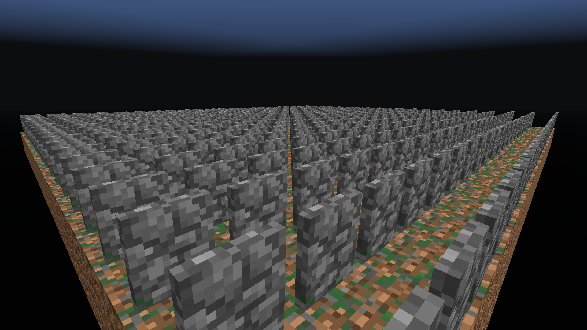
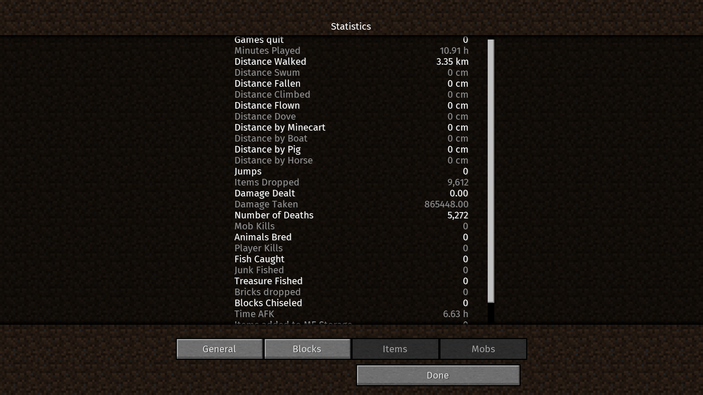
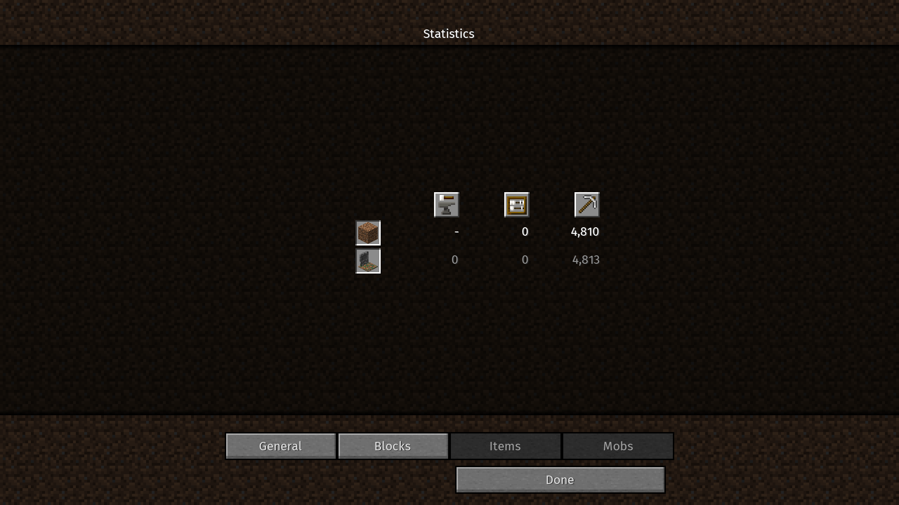
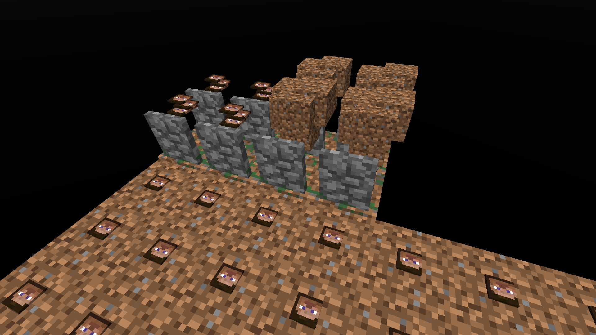

When spawning in, you will immediately fall into the void. Toss away your quest-book and make sure the difficulty is set to Hard. Depending on your ruleset, consider tossing the world if you don't like the biome (I avoided tossing).


## Creating the Spawn-Platform

Upon dying, a grave and dirt-block are placed. When respawning, unfortunately, you are not guaranteed to respawn on that newly-created block. Instead, you will respawn at a position chosen randomly (uniformly) from a 20×20 square area of blocks. Later on, we will want to ensure we can respawn on solid ground, so you will have to die over and over again until all 400 possible spawn-positions are filled with graves. Each death taking about 6 seconds, this whole process will take at least 40 minutes.

However, pacifists must concern themselves with mobs at night: Spawned mobs could hurt each other, or could follow you into the void and taking damage. Thus, pacifists must wait out the night in the void, not pressing the "respawn" button until the night is over. The same goes for thunderstorms. A night takes 10 minutes. If you forget to set a timer for the night, you can check the log file of your minecraft instance, e.g. mentioning the time (real, not ingame) of your most recent death.



After spending at least 80 minutes dying painfully, you have your spawn-platform! Check for slime-chunks, and place journeymap-waypoints at the four corners of the platform.

## Planning Ahead: Preparations for Getting To LV

LV requires vacuum-tubes, which require molds, requiring a smeltery, requiring lava, which requires villagers, who in turn **require a golden apple**. Golden apples can not be crafted until LV, so we will have to obtain them some other way for now.

In a non-pacifist run, you would get the golden apple from lootbags (sourced from a mob farm), or by bartering lucrum (also sourced from a mob-farm) with a [Pech](https://thaumcraft-4.fandom.com/wiki/Pech). Pacifists can't obtain lootbags, so we must trade with Pechs. Without a mob farm, it is extremely difficult for us to source lucrum, but there are three ways:

- Some ic2 crops, which will likely require at least a stack of cropsticks to crossbreed. Crafting cropsticks requires tools, which in turn require metal, which pacifists can (for now) only obtain via... Pech bartering. <!-- TODO: Add link to cropstick calculation -->
- Emeralds, which [villagers passively shed](https://ftb.fandom.com/wiki/Natural_Shedding) every 3 hours (in expectation). This is only viable after you get your first golden apple.
- Gold coins from a [warptheory warp-event](https://gtnh.miraheze.org/wiki/Thaumcraft_Tips#Appendix_2:_Warp_Events) (explained in more detail [below](#warp-jail))

Thus, before we get crops or a golden apple, we must farm gold coins via warp-events.

- If you give a Pech a gold-coin, they give you a golden apple with probability ≈0.21%, requiring 476 gold coins (in expectation) before you get your first golden apple.
- If you play your cards right, you can get metal oreberries via crossbreeding by using ≈70 cropsticks (_in expectation_). Summing up the different metals Pech trades give you (and assuming you re-barter anything they give you), you get enough metal to make something like 2.5 cropsticks (in expectation) per traded gold coin, but this assumes fungibility of metals and ignores that you need a certain metal-threshold before you can make tools. Ballparking the numbers, let's say you need about 50 gold coins before you get metal oreberries (at which point, if you had infinite cobblestone to make mortars, you could make as many cropsticks as you'd like).

Additionally, Pech will take 10 gold coins to be tamed (in expectation), and have a 1% chance of becoming untamed whenever you give them a gold-ingot.

Farming gold-coins via warp-events takes a lot of effort to set up every time, and will almost certainly result in any tamed Pech despawning again. Thus, it's more efficient (in expectation) to play it safe and get more than 50 gold coins. I will aim to get something like **84 gold coins** (in expectation) before attempting to tame a Pech.

Getting 84 gold coins will require AFK-ing **for a week** (168 hours!!!) in warp-jail (in expectation). Without AutoHotKey, you would have to check your game roughly every 10 minutes, by the way.

To make this AFK session as painless (for us, and for the mobs) as possible, we must set up a warp-jail. This will require lots of resources, but will be worth it: Without a warp-jail, you are forced to idle at night and during rain (which will at least _double_ the time we must spend in warp-jail), and you can't realistically use AutoHotKey for AFK-ing.

### Warp-Jail


## Getting More Dirt

For an early spawn-chamber and later projects, pacifists will need a lot more dirt. You will need:

- 400 dirt for your spawn-platform (these are already placed now, congrats!)
- At least 1250 dirt (about 19.5 stacks) for the water-cage of the warp-jail <!-- TODO: add link -->
- If you plan on building a water-containment-platform, at least an additional 2500 dirt (about 39 stacks). This is somewhat optional, but if you mess up during the warp-age, you can cause squid to spawn and fall into the void. If that happens, it feels appropriate for my run to be forfeit, as such an accident could have been prevented by building the water-containment-platform, so I will treat the water-containment-platform as required.
- A decent amount of additional dirt for bridges and early spawn-chambers.

Later on, ic2-crops will also require lots of dirt, but it will be easier to get by that point, and we will conveniently be able to farm dirt for an additional 8 hours for basically free while we're transitioning from the dirt-age to the warp-age.

In total, I decided to get at least 5000 dirt. Exploding dirt-creepers is banned by the ruleset. At 6 seconds per death, farming 5000 dirt via grave-dirt takes at least 8 hours, _not_ counting time spent idling in the void at night or during thunderstorms.

<details>
  <summary>My stats after farming </summary>
  
  
  
</details>

### How to farm dirt

If you just dig a dirt-block while standing on an adjacent one, you most likely won't be able to catch the dirt. One method involves creating a bridge below your platform (grave-dirt will only spawn above y=4, so there is a little space below) and standing beneath the dirt while digging it. The method I used instead catches the dirt by jumping after it into the void:

1. Spawn in, look down
2. Walk slightly to the left so that you're on an adjacent grave, but your cursor is still looking at the grave you spawned in on
3. Mine the grave and dirt-block below you
4. Wait a split second
5. Walk to the right to catch the dirt-block. Keep your (x, z) coordinates at the position you just spawned in on, so that the hole you just jumped down into is patched up by another piece of grave-dirt
6. Perish and respawn

This method can be automated using [AutoHotKey](https://autohotkey.com), though you will still need to idle in the void at night and during thunderstorms. For steps 2 and 5, it's convenient to expand your spawn-platform to 22×20 first. I finished farming the dirt within two days.

A more convenient method would be: Get torches, ensure your spawn-platform contains no slime-chunks, and light up the whole platform (somehow). That way, you could farm dirt without having to idle at night or during thunderstorms. However, there is some glitch involving lighting: Whenever I respawned on the lit-up spawn-platform, some blocks randomly had their light-level reduced to a level that mobs could spawn on. This was not just cosmetic, mobs _could_ spawn there. So I couldn't use that method.


## Getting Torches

Torches provide light, can be farmed very easily and quickly AFK (even without AutoHotKey), and can be used as building-material using draconic-place, where they can create staircases and easy bridges.

Before getting torches, you can (and should) spawn-proof individual blocks draconic-placing an item on them, likely the skull-item for now. Open all the graves (grave-skeletons don't shoot arrows), and create some extra graves near your spawn-platform, which should contain either dirt or skulls but not both. Spawn-proof and label those storage-graves by draconic-placing the item they contain on top.



You will likely not be able to do this within a single day, so while there are still valid spawn-locations you must keep idling in the void at night and during thunderstorms. You can also plan ahead and start building the foundation of your mob farm, skipping spawn-proofing some blocks.


### Early Mob Farm
Our mob-farm has the following requirements:

- Able to spawn skeletons
- Physically isolated spawn-chambers, to avoid mobs hurting each other
- Able to extract any singular mob from the farm without extracting any other mob

The following design is provably optimal, in the sense of minimising the amount of dirt required. A top-down perspective of the farm: `██`=Dirt, `{}`=SpawnLocation:

```
  ██  ██  ██  ██  ██  ██  ██  ██  ██  ██      
██{}██{}██{}██{}██{}██{}██{}██{}██{}██{}██    
  ██{}██{}██{}██{}██{}██{}██{}██{}██{}██{}██  
    ██  ██  ██  ██  ██  ██  ██  ██  ██  ██    
```

Each spawn-chamber must be 3 blocks tall, because some skeletons or zombies can spawn as giants, even in 2-block-tall spaces, and will suffocate in the ceiling. We need ceilings to protect mobs from sunlight and rain, and prevent some mobs from teleporting. To avoid enderman-spawns (which we don't care for at best, and will pick apart your farm at worst), you should draconic-place some item on the underside of the ceiling. Remember to spawn-proof the top of every block that's exposed to the sky.

<!-- TODO: Add image of outside, viewed from the top to display spawn-proofed tops -->
<!-- TODO: Add image of cut-open farm, revealing the draconic-placed cealing inside -->

You could try saving some dirt by making some of the walls out of draconic-placed skull-items, but that might leak out small mobs and will prevent spawns during daytime, and you should have more than enough dirt right now anyway.
